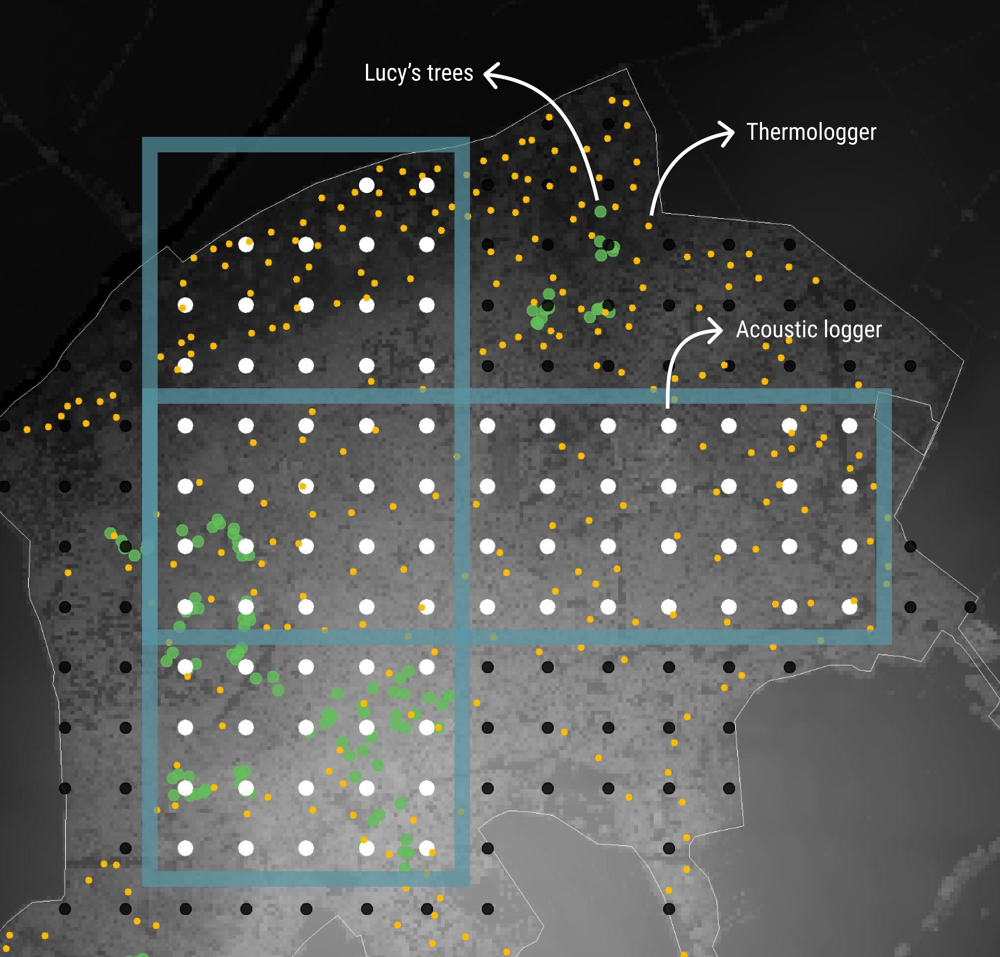

# Data sources: Wytham Woods 2025

This document outlines the technical specifications for the acoustic monitoring dataset collected in Wytham Woods during the 2025 field season.

 

## 1. Sampling design

**Study Area:** Wytham Woods, Oxfordshire
**Year:** 2025

The sampling strategy was designed to capture acoustic diversity across a heterogeneous forest environment, balancing spatial coverage with the detection limits of the hardware.

### Grid configuration
*   **Units:** 81 AudioMoth autonomous recorders.
*   **Layout:** 100 × 100 m regular grid.
*   **Topography:** The grid spans an elevation gradient of ~70–160 m.

### Detection range
Detection probability is non-uniform and depends on species loudness, vegetation density, and weather conditions.
*   **Rationale:** The 100 m spacing was selected to maximize spatial coverage while maintaining partial overlap. This means there will be varying levels of autocorrelation/pseudoreplication for different species.

---
## 2. Equipment & configuration

| Component | Specification |
| :--- | :--- |
| **Recorder** | AudioMoth (Open Acoustic Devices) |
| **Hardware versions** | Mix of v1.1 and v1.2 (randomly distributed across grid) |
| **Housing** | Custom weatherproof enclosures |
| **Mounting** | Thin stakes at **1.6–1.8 m** above ground level |
| **Firmware** | Custom Bat/Bird Firmware ([Source Code](https://github.com/nilomr/AudioMoth-Wytham-Woods/tree/dev/bats)) |
| **Batteries** | 3x D cell batteries |

**Hardware version note:** The deployment includes both AudioMoth hardware v1.1 and v1.2 units (not to be confused with firmware versions). These are deployed randomly across the grid to avoid entire areas having a single version, allowing better detection of any systematic differences in performance between hardware versions.

---

## 3. Recording regimes

The deployment was split into two phases to optimise for bird and bat monitoring.

### Phase 1: Standard bird monitoring

*   **Dates:** 15 February 2025 – 20 July 2025
*   **Sample Rate:** 48 kHz
*   **Gain:** Medium
*   **Cycle:** 60s recording / 300s sleep
*   **Schedule:**
    *   **Pre-sunrise:** 80–120 mins *before* sunrise.
    *   **Post-sunset:** 120–30 mins *after* sunset.
    *   *Note: Schedules used 1-minute rounding.*

### Phase 2: Dual bird & bat monitoring
*Focus: Continued bird monitoring with added high-frequency ultrasonic triggers for bat detection.*

*   **Dates:** 20 July 2025 – 30 Aug 2025 (actual end dates in September will vary by recorder, choose a cutoff)
*   **Sample Rates:** 48 kHz (Audible) & 250 kHz (Ultrasonic)
*   **Key Changes:**
    *   **Added:** 3-hour continuous high-frequency sampling block immediately post-sunset for bats.
    *   **Removed:** 1-hour pre-sunset recording block used in Phase 1.
    *   **Firmware:** Switched to custom firmware supporting combined recording modes.

> **Technical note on sample rate transition:**
> Sample rate transition (48 kHz → 250 kHz) was programmed to occur Sun Jul 20 2025 11:00:00 GMT+0

---

## 4. Deployment & maintenance

### Initial deployment

**Time estimate:** 2–3 full days for a single efficient person on foot.

**Firmware strategy:**

There are two approaches for managing the firmware transition between Phase 1 and Phase 2:

*   **Option 1 (more tested):** Program units with standard firmware for Phase 1 bird monitoring, then reprogram all units in the field in July with custom firmware for Phase 2. This replicates the first year's approach and is more thoroughly tested, but requires field reprogramming.
*   **Option 2 (time-saving):** Review, test, and use the custom firmware from initial deployment. This eliminates the need for July reprogramming, saving significant field time, but the firmware is less tested in practice.

**Important:** The custom firmware will need updating of dates and scheduling parameters for the new season. I recommend becoming acquainted with the firmware code and configuration regardless of which option you choose.

**Logger preparation:**
*   All loggers should be pre-programmed and left in Custom mode before deployment.
*   In Custom mode, they enter a listening state, waiting to be activated via acoustic chime from the smartphone app.
*   Activation sets both the clock and GPS position (position accuracy depends on smartphone GPS module, as AudioMoth units do not have built-in GPS).
*   **Important:** Be careful not to activate other units nearby, as all will be in listening mode simultaneously.

**Deployment strategy:**
*   Cases are labelled from previous deployments.
*   Option 1: Redeploy loggers to their exact previous positions (use existing labels).
*   Option 2: Switch positions around—this is faster, as labels can be rewritten once a logger is in place rather than planning which logger goes where beforehand.

**Resources:**
*   Guidance: [AudioMoth Getting Started](https://www.openacousticdevices.info/getting-started)
*   Open-source documentation: [AudioMoth Open Source](https://www.openacousticdevices.info/open-source)
Any audiomoth-related questions will have their answers in these resources.

### Maintenance visits

**Frequency:** Approximately every 1.5 months for clock resyncing.

**Battery management:**
*   Ideally check voltage of all units during each visit.
*   Replace batteries as needed—expect one full battery change for most units during the entire deployment period, though some units may require two changes.
*   Battery life varies with temperature, battery health, and other stochastic factors, so monitor voltage trends over time. This can be done by summarizing voltage logs, which are included as part of the file metadata, on a laptop during maintenance visits.

**Clock resyncing procedure (no laptop required):**
1. Turn the unit off.
2. Turn it back on in Custom mode.
3. The unit enters listening mode.
4. Use the smartphone app to reset clock and GPS position.

**Optional laptop checks:**
*   A laptop can be used to check voltage trajectory over time and other diagnostics.
*   This is not strictly necessary for basic maintenance but can be useful for troubleshooting.

---

## 5. Clock drift

All AudioMoth devices were synchronised to UTC prior to deployment, then re-synchronised at approximately 1.5-month intervals during maintenance visits. 

**Deployment window:** 2025-02-15 to 2025-03-18 (~31 days); 23 AudioMoth units assessed.

**Absolute clock drift:** Ranged from 1–100 s, with mean ≈ 42 s and median ≈ 58 s over the deployment (~1.4 s/day on average).

| Direction | Units | Range | Mean | Median |
|-----------|-------|-------|------|--------|
| Ran fast | 7 | 4–63 s | ≈ 27 s | ≈ 22 s |
| Ran slow | 16 | 1–100 s | ≈ 49 s | ≈ 59 s |

<small>For the full clock drift data, see [20250318-clockdrift.csv](../metadata/20250318-clockdrift.csv).</small>

No obvious spatial pattern in drift across grid positions (rows F–J, columns 4–12); variation appears to be primarily between devices. Drift is best interpreted as device-specific oscillator tolerance plus local temperature and power-supply effects.

Approximate average error is consistent with common quartz or MEMS oscillators and with AudioMoth documentation indicating up to about 2 s/day of clock drift. Values are within expectations for low-cost, unsynchronized recorders operating over several weeks, and comparable to typical crystal oscillator tolerances quoted in the electronics literature.

### Implications for analyses

For most community-level, seasonal, or diel pattern analyses, absolute drifts of up to 1–3 s/day over a month are extremely unlikely to affect inference, especially when aggregating over minutes to 30 or 60 minute bins, as I would encourage. Anything finer-scale than that should probably not be attempted.
