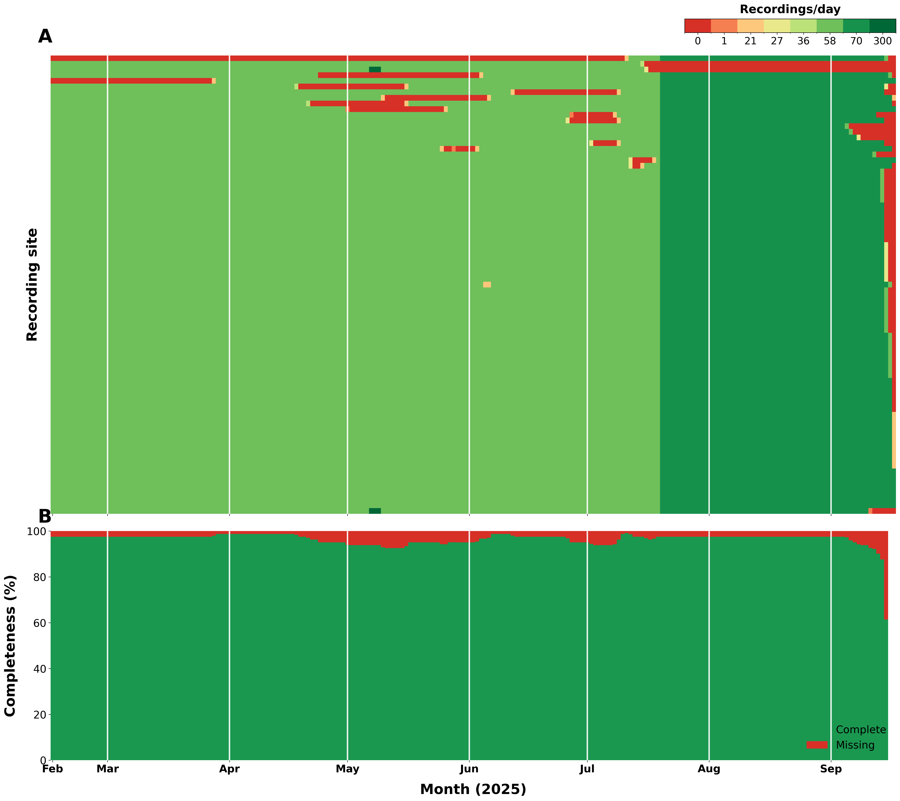

# Data validation scripts

The data validation scripts are located in the `scripts/data-validation/` directory. This documentation provides details on their use.

### Files
- `scripts/data-validation/data-report.py`: Produce a summary CSV/report of collected data and basic validation checks.
- `scripts/data-validation/data-report-plot.py`: Generate plots from a report produced by `data-report.py`.

### Overview
 - These scripts are intended to be run locally after mounting data from the project data server (`bio-lv-colefs01`). They do not fetch data automatically as data are not accessible outside the Oxford Biology network.

### Prerequisites
- Python 3.9 or newer (use the repository virtualenv if available: `phenoscale-pam/bin/activate`).
-  Python packages (install with `pip`):
  - `pandas`
  - `numpy`
  - `matplotlib`
  - `seaborn`


### Accessing data from the server
- Server hostname: `bio-lv-colefs01`
- Project path on server: `data/year-wytham-acoustics`
- Mount the filesystem if it isn't already available

Running the scripts

- Produce a data report (example):
```
cd ../../scripts/data-validation
python data-report.py --data-dir ../../../data/year-wytham-acoustics --out report.csv
```

- Generate plots from a report (example):
```
cd ../../scripts/data-validation
python data-report-plot.py --report report.csv --out plots/

```
### Data completeness report for 2025


### Notes and tips
- Adjust `--data-dir` to point to the local copy of the `year-wytham-acoustics` dataset.
- If the script fails due to missing packages, install the missing package shown in the ImportError message. I'm not providing a reproducible environment as you'll likely be using these as part of a larger project.
